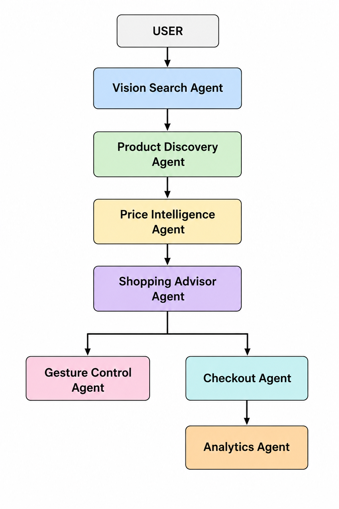
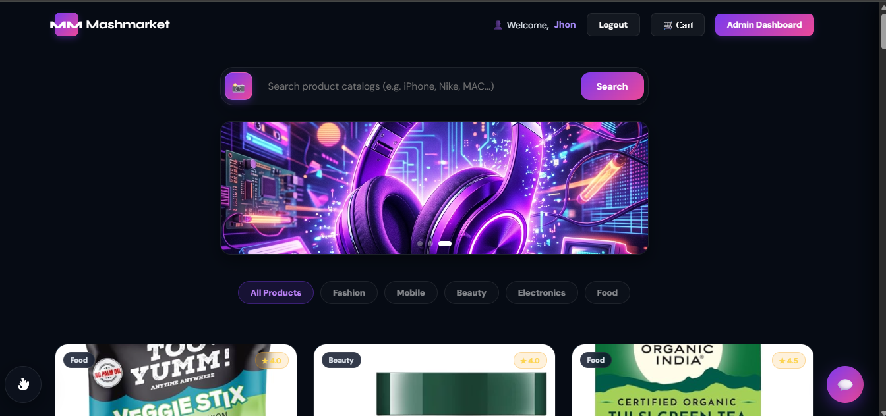
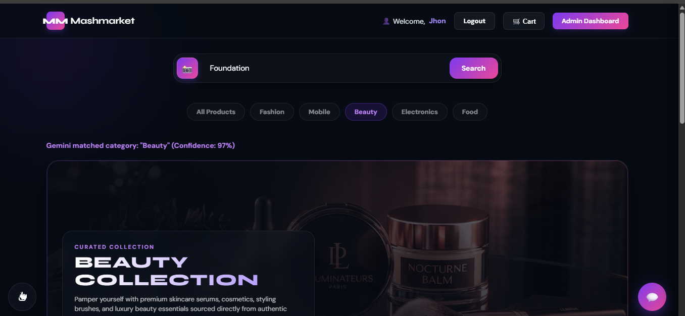
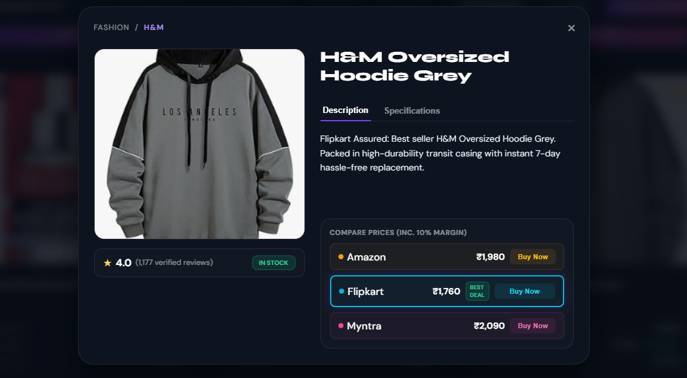
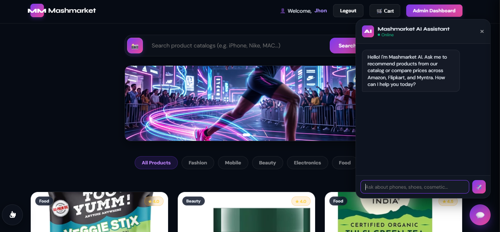
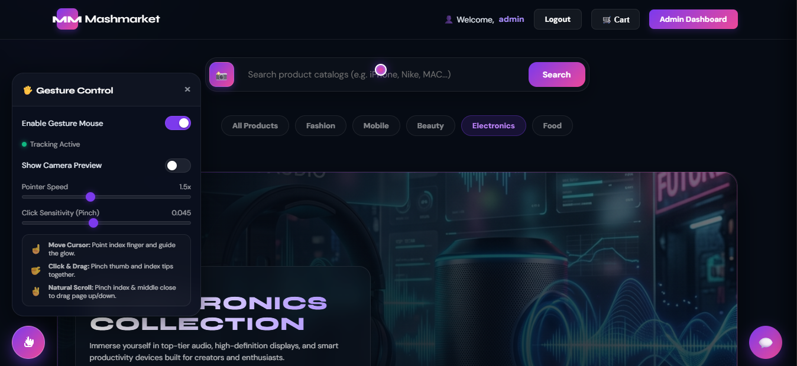
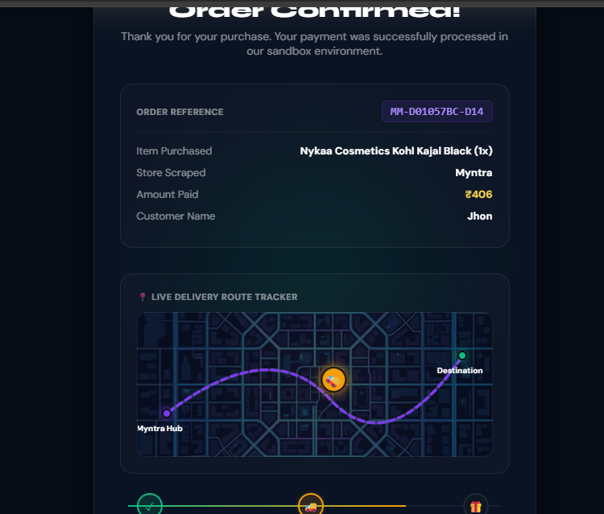
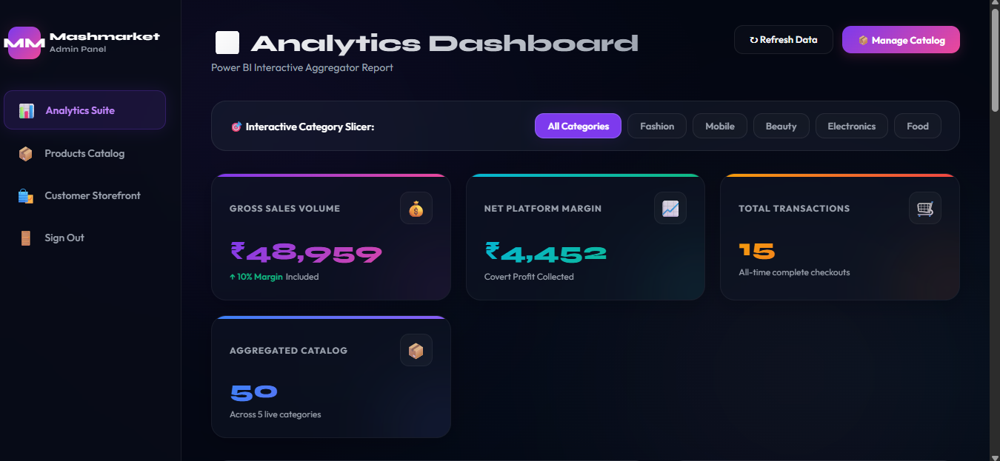

# 🛍️ Mashmart AI

Mashmart AI is a next-generation shopping intelligence platform that helps users discover products, compare prices across multiple marketplaces, receive intelligent shopping assistance, and navigate the platform using real-time hand gestures.

The platform combines AI-powered product discovery, visual search, gesture-based interaction, checkout orchestration, and business analytics into a unified shopping experience.
---
Problem Statement

Online shoppers often face several challenges:

Comparing prices across multiple platforms is time-consuming.
Product discovery requires searching multiple websites.
Reviews and specifications can be overwhelming.
Traditional shopping interfaces depend heavily on mouse and keyboard interactions.
Businesses lack unified analytics across shopping activities.

Mashmarket AI addresses these challenges through a collaborative AI-agent architecture.

---

## 🚀 Features

### 🔍 AI Vision Search
Upload a product image and let AI identify the item and find similar products from the catalog.

### Product Discovery
Current feature:
Searches Amazon, Flipkart, Myntra

### Price aggregator
Current feature:
Compares prices Finds cheapest option

### 💬 AI Shopping Assistant
An intelligent shopping assistant that helps users:
- Discover products
- Compare options
- Get recommendations
- Answer shopping-related queries

### 🛒 Multi-Platform Product Aggregation
Mashmart aggregates products from multiple shopping platforms into a unified interface, making product discovery easier and faster.

### 💰 Dynamic Price Intelligence
Products are processed through a server-side pricing engine to provide secure pricing management and marketplace comparison.

### ✋ Gesture-Based Navigation
Hands-free browsing using computer vision:
- Scroll through products
- Navigate pages
- Select products
- Improve accessibility and user experience

### 🛍️ Smart Cart & Checkout
- Guest cart support
- User cart synchronization
- Order processing workflow
- Interactive checkout experience

### 📊 Analytics Dashboard
Administrative dashboard featuring:
- Sales analytics
- Product insights
- Transaction monitoring
- Platform performance visualization

### 🛠️ Content Management System (CMS)
Administrators can:
- Manage inventory
- Upload promotional banners
- Update category content
- Maintain marketplace listings

---

# 🤖 AI Agent Architecture

Mashmart consists of multiple specialized agents:

1. Vision Search Agent
2. Product Discovery Agent
3. Price Intelligence Agent
4. Shopping Advisor Agent
5. Gesture Control Agent
6. Checkout Agent
7. Analytics Agent

---
## 🏗️ Architecture



---
### User Workflow
- User uploads an image or searches for a product.
- Vision Search Agent identifies the product.
- Product Discovery Agent retrieves matching items.
- Price Intelligence Agent compares available prices.
- Shopping Advisor Agent recommends the best options.
- User navigates using hand gestures or traditional controls.
- Checkout Agent processes the order.
- Analytics Agent records and visualizes transaction insights.
---

## 🛠️ Technology Stack

### Frontend
- HTML5
- CSS3
- JavaScript

### Backend
- Python
- Flask

### Database
- SQLite

### AI & Computer Vision
- Google Gemini
- OpenCV
- MediaPipe

### Data Visualization
- Chart.js

---
Project Vision

Mashmarket AI demonstrates how multiple specialized AI agents can work together to create a smarter, faster, and more engaging shopping experience.

By combining AI reasoning, computer vision, gesture recognition, and business intelligence, the platform showcases the practical application of AI agents in real-world commerce.
---

## 📂 Project Structure

```text
project/
│
├── app.py
├── database.py
├── README.md
│
├── static/
│
├── templates/
│
├── screenshorts/
│
└── docs/
    └── architecture.png
```

---

## 🔧 Installation

### 1. Clone Repository

```bash
git clone https://github.com/YOUR_USERNAME/mashmart-ai.git
```

### 2. Install Dependencies

```bash
pip install -r requirements.txt
```

### 3. Configure Environment Variables

Create a `.env` file:

```env
GEMINI_API_KEY=your_api_key_here
```

### 4. Run Application

```bash
python app.py
```

Open:

```text
http://127.0.0.1:5000
```


## 📸 Screenshots


### Home Page



### AI Vision Search



### Product details



### AI Shopping Assistant



### Gesture Navigation



### Order Checkout


### Analytics Dashboard




---


## 🔮 Future Enhancements

- Voice-controlled shopping
- Marketplace API integrations
- Advanced recommendation systems
- Mobile application
- Real-time order execution workflows

---

## 📜 License

This project was developed for educational, research, and demonstration purposes.
